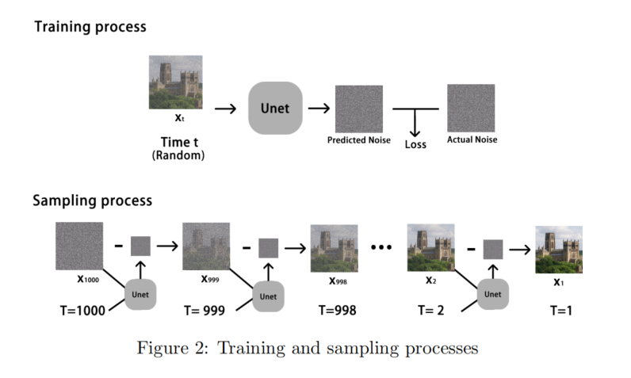
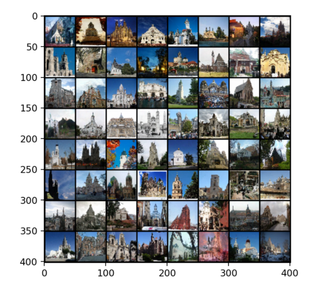
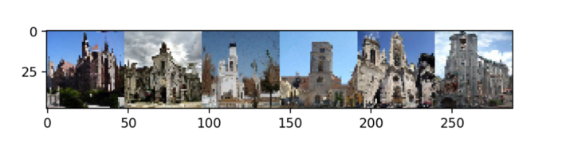

# Generating-Images-with-Denoising-diffusion-probabilistic-model
 This [paper](paper.pdf) focuses on using the model to learn and generate 48x48 pixels church images based on the LSUN dataset.
 [Code](code.py) 

##  Methodology

  
## 2.Results

  
## 3.Interaction-with-data

